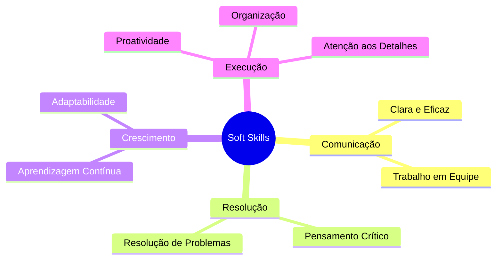

# 🚀 Olá! Eu sou **Vinícius Ansbach Costa** 

<div align="center">
  
</div>

<div align="center">
  
  [](https://linkedin.com/in/vinicius-ansbach)
  [](https://github.com/Ansbach-0)
  [](mailto:ansbach.vinicius@gmail.com)
  [](https://wa.me/+5511959901920)
  
</div>

---

## 🎯 Sobre Mim

```python
class ViniciusAnsbach:
    def __init__(self):
        self.name = "Vinícius Ansbach Costa"
        self.location = "São Paulo, SP - Brasil"
        self.role = "Desenvolvedor de Software | Estudante de Ciência da Computação"
        self.university = "Universidade Cruzeiro do Sul"
        self.semester = "6º Semestre"
        self.languages = ["Português (Nativo)", "Inglês (C2)", "Alemão (Básico)", "Espanhol (Básico)"]
        
    def current_focus(self):
        return [
            "Desenvolvimento de APIs RESTful",
            "Automação e Web Scraping", 
            "Análise de Dados",
            "Arquitetura de Software",
            "Microsserviços"
        ]
    
    def get_motto(self):
        return "Transformando ideias em código, código em soluções! 💡"
```

<div align="center">
  
</div>

---

## 🛠️ Tech Stack

### 💻 Linguagens de Programação
<div align="center">
  
  
  
  
  
  
  
</div>

### 🔧 Frameworks & Bibliotecas
<div align="center">
  
  
  
  
  
  
  
</div>

### 🗄️ Bancos de Dados
<div align="center">
  
  
  
  
  
</div>

### 🛠️ Ferramentas & Tecnologias
<div align="center">
  
  
  
  
  
  
  
</div>

---

## 📊 GitHub Analytics

<div align="center">
  
  
</div>

<div align="center">
  
</div>

<div align="center">
  
</div>

---

## 🎯 Projetos em Destaque

### 🤖 Bot de Automação de Vendas Discord
**Tecnologias:** `Python` `Discord.py` `SQLite3` `API Mercado Pago`

🔹 Sistema completo de automação de vendas para Discord  
🔹 Integração com API do Mercado Pago para pagamentos PIX  
🔹 **+30 transações processadas automaticamente**  
🔹 Arquitetura multi-servidor com logs detalhados  

[](https://github.com/Ansbach-0)

### 📝 Sistema de Blog com Autenticação
**Tecnologias:** `Python` `Flask` `SQLAlchemy` `Bootstrap`

🔹 Aplicação web completa com sistema de posts e comentários  
🔹 Autenticação segura com Flask-Login  
🔹 Interface responsiva e moderna  
🔹 Banco de dados relacional estruturado  

[](https://github.com/Ansbach-0)

### 🌡️ Monitor de Temperatura GPU/CPU
**Tecnologias:** `C#` `.NET Framework` `Windows Forms`

🔹 Interface gráfica para monitoramento em tempo real  
🔹 Gráficos dinâmicos de temperatura  
🔹 Aplicação leve e eficiente  
🔹 Baixo consumo de recursos do sistema  

[](https://github.com/Ansbach-0)

---

## 🎓 Formação Acadêmica

<div align="center">

| 🎓 Curso | 🏛️ Instituição | 📅 Período | 📋 Status |
|----------|----------------|------------|-----------|
| **Bacharel em Ciência da Computação** | Universidade Cruzeiro do Sul | 2023 - 2026 | 🟢 Em Andamento |
| **Técnico em Análise e Desenvolvimento** | ETEC Professor Camargo Aranha | 2020 - 2022 | ✅ Concluído |

</div>

---

## 🏆 Certificações

<table align="center">
  <tr>
    <td align="center">
      <br>
      <strong>100 Days of Code Python</strong><br>
      <em>Udemy</em>
    </td>
    <td align="center">
      <br>
      <strong>Bootcamp .NET</strong><br>
      <em>DIO</em>
    </td>
  </tr>
  <tr>
    <td align="center">
      <br>
      <strong>Excel Avançado</strong><br>
      <em>ENAP</em>
    </td>
    <td align="center">
      <br>
      <strong>English Certificate C2</strong><br>
      <em>EF Standard English Test</em>
    </td>
  </tr>
</table>

---

## 🌍 Idiomas

<div align="center">
  
  
  
  
  
  
</div>

---

## 💼 Competências Interpessoais

<div align="center">



</div>

---

## 📈 Estatísticas de Contribuição

<div align="center">
  
</div>

<div align="center">
  
  
</div>

---

## 🎯 Objetivos 2025

- [ ] 🚀 Conseguir estágio em desenvolvimento de software
- [ ] 📚 Aprofundar conhecimentos em Cloud Computing
- [ ] 🔧 Contribuir para projetos open source
- [ ] 📊 Expandir conhecimentos em Data Science
- [ ] 🌐 Desenvolver mais projetos full-stack

---

## 🤝 Vamos nos conectar?

<div align="center">
  
  💬 **Estou sempre aberto para discussões sobre tecnologia, projetos colaborativos e oportunidades de aprendizado!**
  
  <br>
  
  [](https://linkedin.com/in/vinicius-ansbach)
  [](https://github.com/Ansbach-0)
  [](mailto:ansbach.vinicius@gmail.com)
  
  <br><br>
  
  
  
</div>

---

<div align="center">
  
  
  **⭐ Se você gostou dos meus projetos, não esqueça de dar uma estrela nos repositórios! ⭐**
</div>
